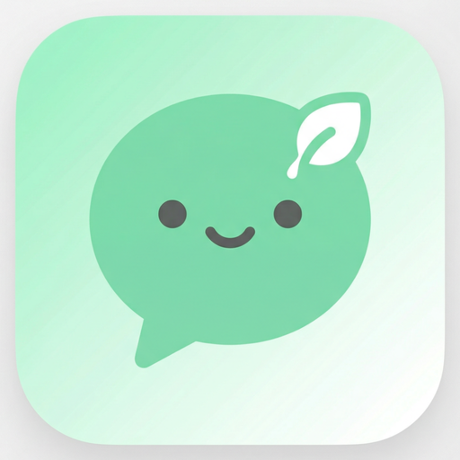
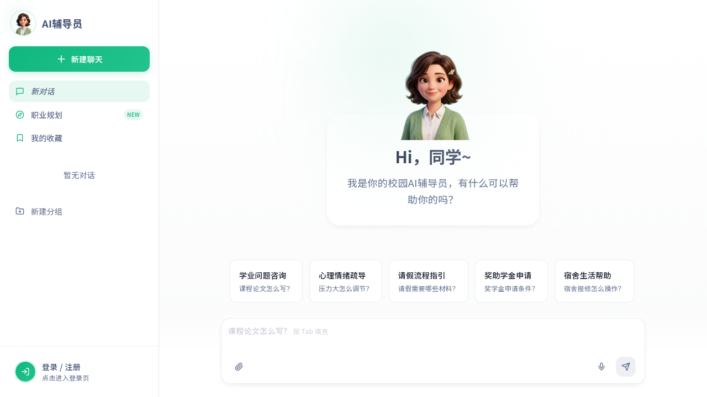
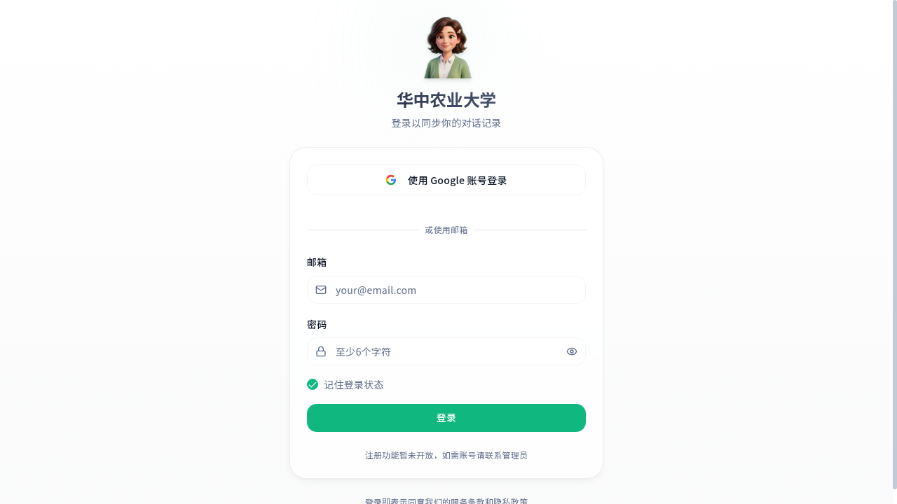

<h1 align="center">校园 AI 辅导员 (Campus AI Counselor)</h1>

<p align="center">
  <a href="https://ai-counselor.top">
    
  </a>
</p>

<p align="center">
  <b>👉 立即访问：<a href="https://ai-counselor.top">https://ai-counselor.top</a></b>
</p>

<p align="center">
  
</p>

<p align="center">
  <i>面向高校学生的智能辅导员助手 —— 基于检索增强生成（RAG）的对话式校园生活与职业规划平台。</i>
</p>

<p align="center">
  <a href="#-功能特性">功能特性</a> ·
  <a href="#-技术栈">技术栈</a> ·
  <a href="#-快速开始">快速开始</a> ·
  <a href="#-部署到自有域名">部署指南</a>
</p>

---

## 📖 项目简介

**校园 AI 辅导员** 是一个为在校大学生打造的智能问答与职业规划平台。它以"知识库严格 grounding + 双通道语义检索"为核心，覆盖**学业咨询、心理疏导、请假流程、奖助学金、宿舍生活、职业规划**等高频校园场景，并配备完整的后台管理与反馈闭环。

* **严格事实回答**：所有回复均基于管理员上传的知识库，找不到则直接告知"暂无相关信息"，杜绝幻觉
* **行内引用 [n]**：每条回答的引用来源可悬浮查看，可追溯
* **职业规划 Agent**：基于 GCDF / BCC 方法论的 8-12 轮深度对话，自动生成 SVG 雷达图报告
* **PWA 支持**：可"添加到主屏幕"，离线可用，移动端体验接近原生 App

## 🖼️ 应用截图

### 主聊天界面
<p align="center">
  
</p>

> 玻璃拟态卡片 + 3D Pixar 风格教师形象 · 5 个快速入口标签 · 支持语音输入 / 文件上传 / Tab 补全

### 登录页
<p align="center">
  
</p>

> 支持 Google OAuth 与邮箱密码登录 · Lazy Login（先聊天，发送时再登录） · 学生身份验证

## ✨ 功能特性

### 学生端
| 模块 | 说明 |
|---|---|
| 💬 智能对话 | SSE 流式输出 · 行内引用 · 2-3 条追问建议 · 历史会话按时间分组 |
| 🗂️ 会话管理 | 拖拽分组、置顶、收藏、重命名、Tab 切换占位词 |
| 🎓 职业规划 | 8-12 轮 GCDF/BCC 深度对话 · 自动生成 SVG 能力雷达图 · 一键跳转 BOSS 直聘 |
| 👤 个人中心 | 自定义头像（1:1 裁剪）· 院校 / 年级数据选择 · 学生身份认证 |
| 🎙️ 语音输入 | 基于 Web Speech API，移动端胶囊式输入框聚焦自动展开 |
| 📱 PWA | 自定义校园 AI 教师图标，可安装到桌面 |

### 管理端
| 模块 | 说明 |
|---|---|
| 📊 数据看板 | Recharts 可视化 · 多维度时间筛选 · 用户增长 / 反馈趋势 |
| 📚 知识库 | 上传 PDF / Office 文件 · 在线预览 · 调用统计 |
| 👍 反馈管理 | 正负反馈标签化 · Resend 邮件实时通知管理员 |
| 🔐 角色管理 | Super Admin / Admin 分级，基于 RLS 的安全策略 |
| 🔍 语义检索 | 后台直接搜索向量库，验证召回效果 |

## 🤖 AI 检索架构

采用**双通道 RAG 召回**，兼顾精确匹配与语义理解：

```
用户提问
   │
   ├── 通道 A：TF-IDF（结合 jieba 中文分词）—— 关键词 / 实体精准命中
   │
   └── 通道 B：pgvector 余弦相似度（OpenAI text-embedding-3-small）—— 语义相近召回
            │
            ▼
       结果融合 + 重排 + Top-K
            │
            ▼
   LLM 严格 grounding 回答 + 行内引用 [n] + 追问建议
```

* **严格回答策略**：检索为空时直接回复"暂无相关信息"，不编造
* **引用即可追溯**：每个 `[n]` 对应一个具体的文件片段，鼠标悬浮即可查看出处

## 🛠 技术栈

| 层 | 技术 |
|---|---|
| 前端 | React 18 · Vite 5 · TypeScript 5 · Tailwind CSS 3 · shadcn/ui · Framer Motion |
| 后端 | Lovable Cloud (Supabase) · PostgreSQL · pgvector · Row Level Security |
| 鉴权 | Supabase Auth（Email + Google OAuth） |
| 文件 | Supabase Storage · 在线 PDF / Office 预览 |
| AI | OpenAI GPT / Lovable AI Gateway · text-embedding-3-small · SSE 流式 |
| 邮件 | Resend（反馈通知） |
| 部署 | Lovable · 自定义域名 `ai-counselor.top` |

## 🚀 快速开始

```bash
# 1. 克隆仓库
git clone <your-repo-url>
cd campus-ai-counselor

# 2. 安装依赖
npm install

# 3. 启动开发服务器
npm run dev
```

> 后端（数据库 / 鉴权 / Edge Functions）通过 Lovable Cloud 自动开通，无需手动配置 Supabase 实例。

### 环境变量

`.env` 由 Lovable Cloud 自动注入，无需手动维护：

```
VITE_SUPABASE_URL=...
VITE_SUPABASE_PUBLISHABLE_KEY=...
VITE_SUPABASE_PROJECT_ID=...
```

## 📂 项目结构

```
src/
├── components/
│   ├── chat/         # 聊天主界面、侧边栏、消息气泡、语音输入
│   ├── admin/        # 后台管理（用户、知识库、反馈、角色）
│   ├── career/       # 职业规划报告与雷达图
│   └── auth/         # 登录注册、学生认证
├── hooks/            # useAuth · useConversations · useUserRole ...
├── pages/            # Index · Auth · Admin · Career
├── lib/              # chatApi (SSE) · utils
└── integrations/supabase/   # 自动生成，请勿手动修改

supabase/functions/
├── chat/                 # 主聊天 Edge Function（RAG + SSE）
├── career-agent/         # 职业规划 Agent
├── semantic-search/      # pgvector 语义检索
├── parse-document/       # PDF / Office 文件解析入库
└── send-feedback-notification/  # 反馈邮件通知
```

## 🔒 安全

* 所有数据表均启用 **Row Level Security**
* 角色存储于独立的 `user_roles` 表，通过 `has_role()` SECURITY DEFINER 函数判定，杜绝提权
* **注册入口已关闭**，账号由管理员统一分发

## 📄 License

MIT © Campus AI Counselor
