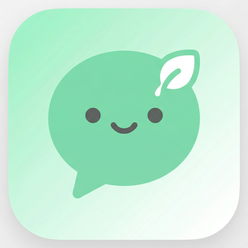

<h1 align="center">校园 AI 辅导员 · Campus Buddy AI</h1>

<p align="center">
  <b>智联招聘 × 扣子 AI 黑客松参赛作品 · 基于 GCDF / BCC 方法论的 AI 求职与职业规划 Agent</b>
</p>

<p align="center">
  <a href="https://campus-buddy-ai-803.lovable.app">
    
  </a>
  <br/>
  <sub>🟢 已上线 · 免注册即可试用 · 支持 PC / 手机 / PWA 安装到桌面</sub>
</p>

<p align="center">
  
</p>

---

## 🏆 关于本作品

本项目参加 **智联招聘 × 扣子（Coze）联合举办的 AI 黑客松 · AI + 求职赛道**。

我们用「会聊、会听、会出报告、还能陪你走完投递」的 AI 求职辅导员，帮助大学生：

- 🎯 **想清楚自己**：8–12 轮 GCDF / BCC 方法论深度对话，挖掘兴趣、能力、价值观
- 🗺️ **看清路线**：游戏化职业地图 + 真实岗位画像（含社媒声音）
- 📊 **看见自己**：对话结束自动生成 SVG 能力雷达图与个性化报告
- ✍️ **改好简历**：AI 简历编辑，结合岗位 JD 给出改写建议
- 🚀 **一键投递**：根据画像直跳 **智联招聘 / BOSS 直聘** 搜索匹配岗位
- 🐾 **陪伴**：桌宠悬浮助手 + PWA 安装到桌面，随时唤起

## ✨ 核心功能

| 模块 | 说明 |
|---|---|
| 🎓 职业规划 Agent | 基于 **GCDF（全球职业规划师）/ BCC（生涯教练）** 方法论的 8–12 轮深度对话 |
| 🗺️ 莫奈花园职业地图 | 游戏化职业地图：30+ 岗位 · 9 大章节 · 沉浸式探索 |
| 📈 能力雷达图 | 对话结束自动生成 SVG 雷达图，可视化多维能力 |
| 🧾 岗位画像 | 聚合岗位职责 / 任职要求 / 真实社媒声音，避免"信息差" |
| 📝 AI 简历编辑 | 结合 JD 给出针对性改写建议，导出可用简历 |
| 🔗 求职平台直达 | 一键根据画像跳转智联招聘 / BOSS 直聘 |
| 🐾 桌宠助手 | 悬浮窗形态的陪伴式 AI，可固定在桌面一角 |
| 💬 SSE 流式对话 | 边想边答 · 移动端胶囊式输入 + 语音输入（Web Speech API） |
| 📱 PWA 支持 | "添加到主屏幕"，移动端体验接近原生 App |

## 🤖 技术亮点

- **方法论驱动**：Agent 的 system prompt 与对话编排严格基于 GCDF / BCC 职业咨询框架
- **双通道 RAG**：TF-IDF（中文分词）+ pgvector 向量检索，严格 grounding，不编造
- **结构化输出**：长对话自动归纳为可视化报告（SVG 雷达图 + Markdown 报告）
- **Supabase 全栈**：Auth + RLS + Storage + pgvector + Edge Functions，一体化
- **零门槛体验**：免注册即可试用，对话记录本地 + 云端双持久化

## 🛠 技术栈

| 层 | 技术 |
|---|---|
| 前端 | React 18 · Vite 5 · TypeScript 5 · Tailwind CSS 3 · shadcn/ui · Framer Motion |
| 后端 | Lovable Cloud (Supabase) · PostgreSQL · pgvector · Edge Functions |
| AI | Lovable AI Gateway（Gemini / GPT 系列） · SSE 流式输出 |
| 可视化 | 手写 SVG 雷达图 · 莫奈花园风格游戏化地图 |
| 部署 | Lovable · https://campus-buddy-ai-803.lovable.app |

## 🚀 快速开始

```bash
git clone <your-repo-url>
cd campus-buddy-ai
npm install
npm run dev   # http://localhost:8080
```

> 后端（数据库 / Edge Functions / pgvector）通过 Lovable Cloud 自动开通，无需手动配置。

## 📂 项目结构

```
src/
├── components/career/        # 职业规划报告 / 雷达图 / 桌宠
├── pages/CareerMap.tsx       # 莫奈花园职业地图
├── pages/CareerResume.tsx    # AI 简历编辑
├── pages/CareerFeed.tsx      # 岗位画像 / 社媒声音
├── hooks/useCareerConversation.ts   # 对话状态管理
└── integrations/supabase/    # 自动生成，请勿手动修改

supabase/
├── functions/career-agent/   # GCDF/BCC 编排 + SSE 流式
└── migrations/               # 数据库 schema + RLS 策略
```

## 📄 License

MIT © Campus Buddy AI · 智联 × 扣子 AI 黑客松参赛作品
